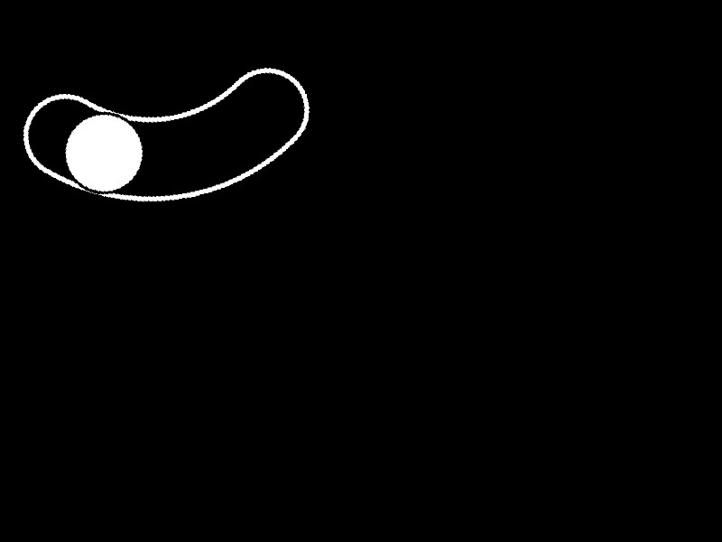

# Semaine 4  

### README ET SCRIPT DU CURSEUR (WAGNER Sébastien) :  
#### Organiser le readme.md :  
  -Mettre au propre le fichier readme du github  

#### Créer des fonctions de manipulation du curseur :  
  -isSortie -> Vérifie si le curseur se trouve bien dans la fenêtre du jeu  
  -viser -> Transforme les coordonnées du curseur relatives à la fenêtre en coordonnées relatives à l'écran  
  -cliquer -> Fonction de clique  

### SCRIPT ENTRAINEMENT AI RECONNAISSANCE IMAGES (MITERAN Justin) :  
#### Créer un script capable de générer une image contenant un slider pour entrainer l'IA de reconnaissance de slider

  -[script](../../Osu!Learn/Code/utilitaire/imgAiTrainer/imgAiTrainer.py) contenant la classe Trainer  
  -[script](../../Osu!Learn/Code/utilitaire/imgAiTrainer/testImgAiTrainer.py) de test la génération d'image dans Assets  

#### Classes Trainer :  
Constructeur :  
      &nbsp;&nbsp;&nbsp;- Trainer()  
Fonctions :  
      &nbsp;&nbsp;&nbsp;.createSlider(taille) *# génère une image noir avec un cercle blanc pour entrainer l'IA*  
      &nbsp;&nbsp;&nbsp;&nbsp;&nbsp;&nbsp;&nbsp;&nbsp;&nbsp;- taille : tuple *# (x,y) taille x et y de l'image en pixels*  
      &nbsp;&nbsp;&nbsp;&nbsp;&nbsp;&nbsp;return :  
      &nbsp;&nbsp;&nbsp;&nbsp;&nbsp;&nbsp;&nbsp;&nbsp;&nbsp;&nbsp;&nbsp;- (x1,y1) : tuple *# Coordonée x et y du centre du cercle de départ du slider*  
      &nbsp;&nbsp;&nbsp;&nbsp;&nbsp;&nbsp;&nbsp;&nbsp;&nbsp;&nbsp;&nbsp;- (x2,y2) : tuple *# Coordonée x et y du centre du cercle de fin du slider*  
      &nbsp;&nbsp;&nbsp;&nbsp;&nbsp;&nbsp;&nbsp;&nbsp;&nbsp;&nbsp;&nbsp;- rayon1 : int *# Rayon du cercle*  
      &nbsp;&nbsp;&nbsp;&nbsp;&nbsp;&nbsp;&nbsp;&nbsp;&nbsp;&nbsp;&nbsp;- rayon2 : int *# Rayon du cercle d'approche du slider* 

### Temps de calcul script détection de cercles (LAVEYSSIERE Cyril) :

#### Temps de calcul moyen pour la détection de cercles (position et rayon) sur une image : 
Test réalisé avec le script -[circleDetection](../../Osu!Learn/Code/circleDetection/main.py) pour un nombre de cercles compris entre 1 et 10 sur une image de taille 800*600 et 10 000 essais généré grâce au script -[imgAiTrainer](../../Osu!Learn/Code/utilitaire/imgAiTrainer/imgAiTrainer.py) :

Temps de calcul moyen : 0.0132 secondes pour  10000 essais
