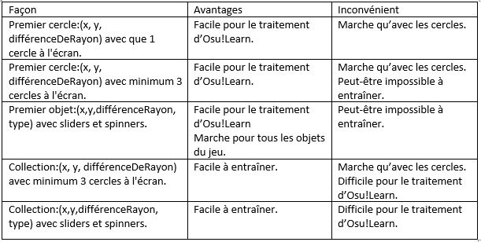

# Semaine 1  

### Définir les outputs du réseau de nerones supervisé(Sébastien Hugo Cyril Ivan):  

Nous allons donc faire plusieurs tests, donc faire plusieurs entrainements:  

  

Nous avons plusieurs tests, car il peut y avoir plusieurs objets à la fois sur une même image.  
Pour l'instant, nous visons un objectif avec une image ayant qu'un seul cercle.  
Les autres test sont pour voir les différentes possibilités pour plus tard.  

