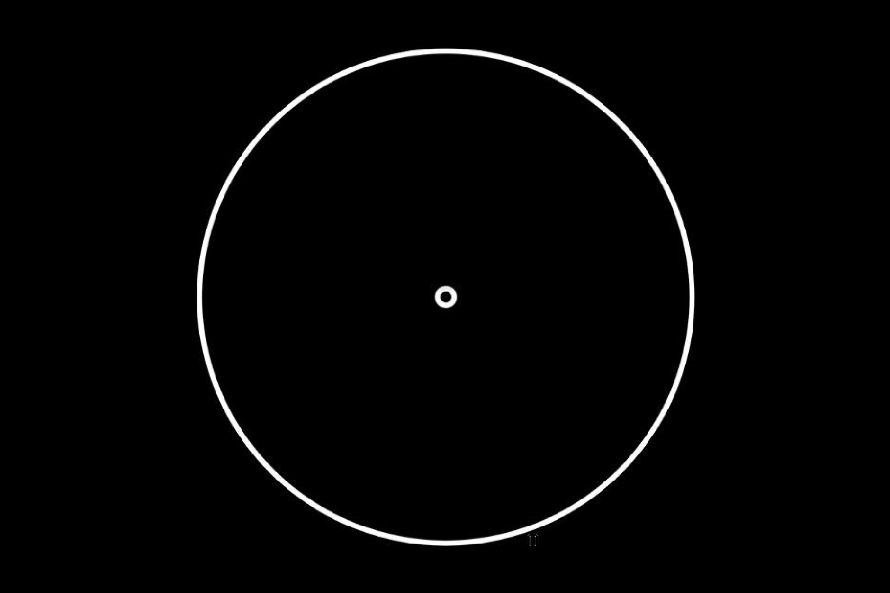

# Semaine 1  

### Définir les outputs du réseau de nerones supervisé(Sébastien Hugo Cyril Ivan):  

Nous allons donc faire plusieurs tests, donc faire plusieurs entrainements:  

  

Nous avons plusieurs tests, car il peut y avoir plusieurs objets à la fois sur une même image.  
Pour l'instant, nous visons un objectif avec une image ayant qu'un seul cercle.  
Les autres test sont pour voir les différentes possibilités pour plus tard.  

### SCRIPT ENTRAINEMENT AI RECONNAISSANCE IMAGES (MITERAN Justin) :  
#### Créer un script capable de générer une image contenant un slider coubé ou un spinner pour entrainer l'IA de reconnaissance d'image

  -[script](../../Osu!Learn/Code/utilitaire/imgAiTrainer/imgAiTrainer.py) contenant la classe Trainer  
  -[script](../../Osu!Learn/Code/utilitaire/imgAiTrainer/testImgAiTrainer.py) de test la génération d'image dans Assets  

#### Classes Trainer :  
Constructeur :  
      &nbsp;&nbsp;&nbsp;- Trainer()  
Fonctions :  
      &nbsp;&nbsp;&nbsp;.createSlider(taille,droit,debut) *# génère une image noir avec un cercle blanc pour entrainer l'IA*  
      &nbsp;&nbsp;&nbsp;&nbsp;&nbsp;&nbsp;&nbsp;&nbsp;&nbsp;- taille : tuple *# (x,y) taille x et y de l'image en pixels*  
      &nbsp;&nbsp;&nbsp;&nbsp;&nbsp;&nbsp;&nbsp;&nbsp;&nbsp;- droit: Boolean *# True pour un slider droit, False pour un slider courbé*  
      &nbsp;&nbsp;&nbsp;&nbsp;&nbsp;&nbsp;&nbsp;&nbsp;&nbsp;- debut: Boolean *# True pour un slider avec le cercle au point de départ, False pour un slider en cours de déplacement*  
      &nbsp;&nbsp;&nbsp;&nbsp;&nbsp;&nbsp;return :  
      &nbsp;&nbsp;&nbsp;&nbsp;&nbsp;&nbsp;&nbsp;&nbsp;&nbsp;&nbsp;&nbsp;- (x1,y1) : tuple *# Coordonée x et y du centre du cercle de départ du slider*  
      &nbsp;&nbsp;&nbsp;&nbsp;&nbsp;&nbsp;&nbsp;&nbsp;&nbsp;&nbsp;&nbsp;- (x2,y2) : tuple *# Coordonée x et y du centre du cercle de fin du slider*  
      &nbsp;&nbsp;&nbsp;&nbsp;&nbsp;&nbsp;&nbsp;&nbsp;&nbsp;&nbsp;&nbsp;- (x3,y3) : tuple *# Coordonée x et y du centre du cercle à viser du slider*  
      &nbsp;&nbsp;&nbsp;&nbsp;&nbsp;&nbsp;&nbsp;&nbsp;&nbsp;&nbsp;&nbsp;- rayon1 : int *# Rayon du cercle*  
      &nbsp;&nbsp;&nbsp;&nbsp;&nbsp;&nbsp;&nbsp;&nbsp;&nbsp;&nbsp;&nbsp;- rayon2 : int *# Rayon du cercle d'approche du slider*  
  
&nbsp;&nbsp;&nbsp;.createSpinner(taille) *# génère une image noir avec un cercle blanc pour entrainer l'IA*  
      &nbsp;&nbsp;&nbsp;&nbsp;&nbsp;&nbsp;&nbsp;&nbsp;&nbsp;- taille : tuple *# (x,y) taille x et y de l'image en pixels*  
      &nbsp;&nbsp;&nbsp;&nbsp;&nbsp;&nbsp;return :  
      &nbsp;&nbsp;&nbsp;&nbsp;&nbsp;&nbsp;&nbsp;&nbsp;&nbsp;&nbsp;&nbsp;- (x,y) : tuple *# Coordonée x et y du centre du cercle du spinner*  
      &nbsp;&nbsp;&nbsp;&nbsp;&nbsp;&nbsp;&nbsp;&nbsp;&nbsp;&nbsp;&nbsp;- rayon : int *# Rayon du spinner* 
